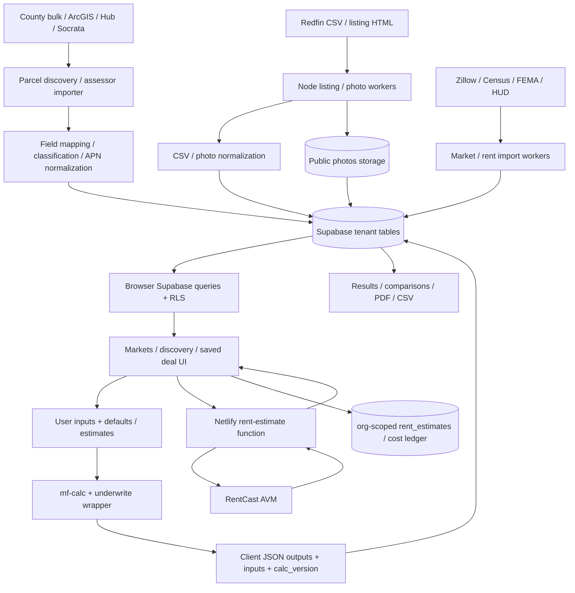

# MFDA ROUND 0 — Independent System Truth & Commercial Readiness Baseline

Audit date: 2026-10-06, America/Phoenix. Some corresponding HTTP timestamps are 2026-10-07 UTC. Audited source: `c800392a3c57cb425dc9ab90ca3cda4893b2e5fd`.

This is a baseline audit, not financial certification or a penetration test of production. **PROVEN** means reproducible source/local behavior or directly observed external metadata. **SOURCE** means implementation evidence without an end-to-end production exercise. **UNVERIFIED** means the necessary runtime, configuration, data, permissions, or independent oracle was unavailable. A local reproduction is not evidence that a production customer has been affected.

## 1. Executive Summary

MFDA is a substantial internal investment workflow: market ranking, listing discovery, parcel screening, saved deals, financing comparisons, projections, tax estimates, goals, PDFs, and campaign exports exist. The calculation package is separated from the UI, and the database has a real organization/RLS foundation. These are useful foundations to retain.

The evidence does not establish stable or commercially trustworthy operation. This audit records **2 P0 findings, 16 P1 findings, 15 P2 findings, and 4 P3 observations**. Counts refer to the numbered findings in sections 23–26; the other sections explain those same findings rather than adding to the count.

Two release-blocking security defects were reproduced with synthetic data: an expired invitation grants tenant administration after the latest bootstrap migration, and cached tenant A deal data appears under tenant B's identity after a change of authenticated user. The database rejected B's subsequent read in the browser probe, but the cached disclosure had already occurred.

Financial/data trust is also blocked. An edit can replace a known 12-unit property count with the default four-unit mix, saving invented rents and square footage. Debt service continues after loan payoff; seller balloon timing does not affect the modeled returns; non-finite IRR input can produce a numeric 1,000% return; break-even occupancy disagrees with the income model when other income exists. Tax modeling omits essential basis, timing, and asset-class detail. Saving a deal, replacing units, and saving the scenario are separate, non-atomic operations.

**430 existing tests pass in 29 test files**, with zero failing or skipped tests. The configured calculation typecheck fails with 35 diagnostics. The frontend builds. There are no existing frontend, browser, database/RLS, or serverless suites. Passing tests therefore do not prove the critical workflows or financial claims above.

GitHub and Netlify corroborate deployment directly from the unprotected MFDA feature branch, with no required status checks. The published Netlify SHA matches the audit SHA. Live database migration state, customer data, county coverage, worker deployment/cron health, backups, restore capability, and most provider integrations remain **UNVERIFIED**.

The top five blockers are tenant access/cache integrity; independently verified underwriting; preservation of unknown and sourced facts; reliable photo/parcel/listing acquisition; and controlled releases with verified operational recovery. No remediation or deployment was performed.

## 2. Audited Repository

| Item | Verified value |
|---|---|
| Working directory | `/Users/davidastone/code/alot-land/alot-land` |
| Canonical GitHub repository | `alot-land/alot-land`, public, not archived |
| Origin fetch/push URL | `https://github.com/alot-land/alot-land.git` |
| Current audit branch | `audit/mfda-round0-2026-10-06` |
| Current branch upstream | None configured |
| Audited HEAD | `c800392a3c57cb425dc9ab90ca3cda4893b2e5fd` |
| MFDA remote branch | `origin/claude/mfda-multifamily-analyzer-nfcv90` |
| Cached and live MFDA branch SHA | `c800392a3c57cb425dc9ab90ca3cda4893b2e5fd` |
| Merge-base | `c800392a3c57cb425dc9ab90ca3cda4893b2e5fd` |
| GitHub default branch | `main`; this is not MFDA's production deployment branch |
| Required directories | `mfda/`, `packages/mf-calc/`, `workers/scan/`: all present |
| Initial tracked working-tree changes | None |
| Initial untracked state | `.netlify/` only; explicitly approved by the user to ignore |

**The ancestry prerequisite passed.** At audit start, HEAD equaled the MFDA remote branch tip and their merge-base; no divergent source changes were present. The cached remote ref, live `git ls-remote`, and GitHub branch API agreed. This establishes the requested current base, although Git ancestry cannot independently prove the historical shell command used to create a branch.

The original request used the owner label `AlotOfLand`. Git remote and GitHub metadata identify this checkout as the canonical `alot-land/alot-land` monorepo. The user subsequently verified this checkout/SHA and authorized continuation. No other repository was substituted.

The five latest commits were:

```text
c800392 Read each county's own land-use vocabulary instead of guessing WHERE clauses
e413634 Click a county on Markets, get its parcels — automatic acquisition queue
00393a5 Record the field-verified statewide parcel findings (TN, VA, IN)
05eb3ff County lanes: make a wrong-county pick impossible, add ArcGIS Hub route
1d74aa0 Add Knox, Anderson and Hamilton TN county lanes — config, not code
```

The `.netlify/` directory was not changed, deleted, staged, used as MFDA source, or added to an ignore file. The final new source-tree files are audit/evidence artifacts under `docs/audits/`. Dependency installation and builds created ignored `node_modules/` and `mfda/dist/` directories; those audit-generated directories were removed after verification, restoring their initially absent state.

## 3. Scope

Inspected MFDA React pages/components/data helpers, its Netlify function and configuration, Supabase schema and every supplied migration, all engine modules and existing tests, worker entry points/helpers/tests, package manifests/lockfiles, git state, shared-engine imports, repository workflows, and relevant external release metadata.

Executed existing tests, the configured typecheck, frontend build, dependency audits, worker/function syntax checks, selected financial/parser/import probes, migrations and adversarial cases in an isolated PostgreSQL instance, and synthetic browser checks at desktop/tablet/mobile widths. Production requests were limited to read-only release metadata, the public site's response headers, and a rent-estimate request **without an address** that cannot reach the provider under the audited implementation.

Source/test/migration/runtime behavior takes precedence over `SPEC.md`, guide text, README assertions, and historical counts. Documentation was used to locate intended behavior and then compared with code.

## 4. Out-of-Scope Areas

Other monorepo applications, their financial engines, the root marketing site's implementation, and unrelated GHL/public-site workflows were not audited. Root configuration was examined only to distinguish it from MFDA's actual build/CI/deployment.

No production database connection, production credential retrieval, production data mutation, tenant attack against production, provider scrape campaign, GHL message sending, deployment, merge, push, or application redesign occurred. No full tax/legal certification, accessibility conformance certification, backup restore exercise, or numerical coverage percentage was attempted.

## 5. Commands Executed

The principal commands establishing the baseline and acceptance evidence are below. Paths in command blocks are the actual local paths used. Read-only inspection additionally used `rg`, `rg --files`, `sed -n`, `nl -ba`, `cat`, `ls`, and JSON parsing against the files cited throughout this report; those inspections are not test results.

Baseline:

```sh
pwd
git remote -v
git status
git branch --show-current
git rev-parse HEAD
git log --oneline -5
git merge-base HEAD origin/claude/mfda-multifamily-analyzer-nfcv90
git rev-parse origin/claude/mfda-multifamily-analyzer-nfcv90
git ls-remote origin refs/heads/claude/mfda-multifamily-analyzer-nfcv90
git status --short
git status --short --ignored mfda packages/mf-calc workers/scan
git ls-files docs
git diff --stat
node --version
npm --version
```

Directory existence, ancestor/local `AGENTS.md`, package/test/configuration files, environment filenames, CI files, and lockfiles were checked with read-only filesystem/git commands. No applicable `AGENTS.md` was found. No audit-document convention existed in tracked `docs/`; the requested `docs/audits/` destination was used.

Release metadata, using filtered outputs rather than credentials/environment values:

```sh
gh api repos/alot-land/alot-land
gh api 'repos/alot-land/alot-land/branches/claude%2Fmfda-multifamily-analyzer-nfcv90' --jq '{name,protected,sha:.commit.sha,protection}'
gh api repos/alot-land/alot-land/rulesets --jq '.[] | {name,enforcement,target}'
gh api repos/alot-land/alot-land/commits/c800392a3c57cb425dc9ab90ca3cda4893b2e5fd/check-runs
gh api repos/alot-land/alot-land/commits/c800392a3c57cb425dc9ab90ca3cda4893b2e5fd/status
netlify api listSites
curl -sS -I https://mfda.alot.land
curl -sS -i https://mfda.alot.land/.netlify/functions/rent-estimate
```

The Netlify response was filtered immediately to site name/domain/repository/build/published-deploy metadata. GitHub responses used fields relevant to identity/protection/checks. No raw credential or environment-value dump was retained.

Dependency setup, executed separately in `packages/mf-calc/`, `workers/scan/`, and `mfda/`:

```sh
npm ci --no-audit --no-fund
```

Tests and checks, with their working directories:

```sh
# packages/mf-calc/
npm test -- --reporter=default --reporter=json --outputFile='/private/tmp/mfda-round0-20261006.GF9GLQ/calc-tests.json' > '/private/tmp/mfda-round0-20261006.GF9GLQ/calc-tests.log' 2>&1
npm run typecheck > '/private/tmp/mfda-round0-20261006.GF9GLQ/calc-typecheck.log' 2>&1

# workers/scan/
npm test -- --reporter=default --reporter=json --outputFile='/private/tmp/mfda-round0-20261006.GF9GLQ/worker-tests.json' > '/private/tmp/mfda-round0-20261006.GF9GLQ/worker-tests.log' 2>&1

# mfda/
npm run build > '/private/tmp/mfda-round0-20261006.GF9GLQ/frontend-build.log' 2>&1

# Each of the three package directories, replacing <package> with calc/worker/frontend
npm audit --json > '/private/tmp/mfda-round0-20261006.GF9GLQ/<package>-audit.json'
npm audit --omit=dev --json > '/private/tmp/mfda-round0-20261006.GF9GLQ/<package>-audit-prod.json'
```

Diagnostic commands:

```sh
node /private/tmp/mfda-round0-20261006.GF9GLQ/diagnostics.mjs
node /private/tmp/mfda-round0-20261006.GF9GLQ/parcel-probes.mjs
npm install --prefix /private/tmp/mfda-round0-20261006.GF9GLQ/browser --no-audit --no-fund playwright
node /private/tmp/mfda-round0-20261006.GF9GLQ/vite.mjs
node /private/tmp/mfda-round0-20261006.GF9GLQ/browser-probes.mjs
```

The diagnostic harness bundled `src/index.ts`, `underwrite.js`, and `parcelscreen.js` with MFDA's installed esbuild and the actual engine alias. It used direct synthetic calls and mocked provider/database fetches. A further `node --input-type=module` probe called `irr([-100, NaN, 200])` and `breakEvenOccupancy(36000, 0, 72000)`. A Node loop ran `node --check` on all 25 worker bin/lib and Netlify-function JS/MJS files. A nonprinting scan of 149 tracked scope files, excluding lockfile payload inspection, checked for long Supabase secret literals, service-role JWT literals, and AWS key-ID patterns; it reported no matches.

Local database setup and execution:

```sh
initdb -D /private/tmp/mfda-round0-20261006.GF9GLQ/postgres-data -A trust --no-locale
pg_ctl -D /private/tmp/mfda-round0-20261006.GF9GLQ/postgres-data -l /private/tmp/mfda-round0-20261006.GF9GLQ/postgres-server.log -o '-k /private/tmp/mfda-round0-20261006.GF9GLQ -p 55446 -h 127.0.0.1' start
psql -h /private/tmp/mfda-round0-20261006.GF9GLQ -p 55446 -d postgres -f /private/tmp/mfda-round0-20261006.GF9GLQ/db-setup.sql
psql -h /private/tmp/mfda-round0-20261006.GF9GLQ -p 55446 -d postgres -f mfda/supabase/schema.sql
# Each migration_*.sql was then applied in filename order with ON_ERROR_STOP.
psql -h /private/tmp/mfda-round0-20261006.GF9GLQ -p 55446 -d postgres -f /private/tmp/mfda-round0-20261006.GF9GLQ/db-probes.sql
psql -h /private/tmp/mfda-round0-20261006.GF9GLQ -p 55446 -d postgres -f /private/tmp/mfda-round0-20261006.GF9GLQ/db-positive-probes.sql
```

The isolated instance used PostgreSQL 17.10, synthetic `auth.users`, `auth.uid()`/`auth.jwt()` functions, `authenticated`/`anon` roles, and a storage bucket stub. The full schema/migration sequence was also reapplied successfully after synthetic rows existed. This is limited syntax/reentrancy evidence, not a complete Supabase upgrade test. No production connection string was used. The final cleanup command was `pg_ctl -D /private/tmp/mfda-round0-20261006.GF9GLQ/postgres-data stop -m fast`; Vite was stopped with Ctrl-C. A scoped Python `shutil.rmtree` cleanup removed only that temporary audit directory and the four audit-created dependency/build directories after confirming the PostgreSQL PID file was gone.

Sandbox DNS/install, local server binding, PostgreSQL shared-memory, browser-launch, and Netlify preference-file restrictions required approved reruns. Initial browser harness failures came from the harness working directory, a locator, and an incorrectly encoded synthetic token; corrected runs completed. They are not counted as application test failures. The corrected preview ran from `mfda/`, with an invalid synthetic Supabase hostname, fake tokens, and all external browser requests blocked. Temporary scripts/processes were cleaned up after evidence capture. Reusable evidence is linked in section 27.

## 6. Repository / Release Truth

The monorepo has independent package/lockfile directories, not a root npm workspace coordinating MFDA. The root Astro marketing package is separate. MFDA is `alot-mfda@0.1.0`; the engine is `@alot/mf-calc@1.14.0`; the worker is `@alot/mfda-scan@0.1.0`.

| Directory | Relevant commands/dependencies |
|---|---|
| `mfda/` | `dev: vite`, `build: vite build`, `preview: vite preview`; React 19, Router 6, React Query 5, Supabase JS, Leaflet, PDF renderer; no test/lint/typecheck scripts |
| `packages/mf-calc/` | `test: vitest run`, `typecheck: tsc`; TypeScript, Vitest 1.6; no runtime dependencies; exports TypeScript source |
| `workers/scan/` | `scan: node bin/scan.mjs`, `test: vitest run`; Node ESM and Supabase JS; no configured lint/typecheck |

`mfda/vite.config.js` aliases `@alot/mf-calc` directly to `../packages/mf-calc/src/index.ts`. Thus the frontend consumes the checked-out engine source at build time, without a separately published engine build. That dependency is in scope; other applications are not.

Node 22.17.0 and npm 11.4.2 were used. Lockfile-based `npm ci` worked after network approval and did not change tracked manifests/locks. Production uses `npm install`, so the audited local command and the deployment command differ. No single source-controlled MFDA verification gate coordinates all three packages.

The GitHub branch API reports `protected: false`, disabled protection, and no required checks/contexts. The repository rulesets endpoint returned no entries. This independently corroborates the user's GitHub evidence. The audited commit has zero check runs and zero commit statuses; combined status was `pending` without checks. This is absence of enforced evidence, not evidence of failing CI.

Only `daily-refresh.yml` and `optimize-images.yml` were found in `.github/workflows/`. They concern the public site/YouTube rebuild and public-image optimization, respectively. Neither tests/builds MFDA, the financial package, migrations, or workers.

Ignored/generated files affect reproducibility: all package dependencies, `mfda/dist/`, local environment files, worker download/cache artifacts, and operator/cron configuration are outside tracked source. No real `.env*` file existed in the three package directories during this audit. The known local `.netlify/` artifact is excluded from the assessment. Deployment environment values, actual worker filesystem state, and a complete production dependency/build provenance chain are **UNVERIFIED**.

## 7. Architecture Discovered

**Frontend:** Vite/React SPA with BrowserRouter, one shared React Query client, Supabase session context, active organization in localStorage, and direct browser-to-Supabase queries. Financial outputs are calculated in the browser and persisted as supplied JSON; no trusted server calculation/validation boundary exists.

Routes in `mfda/src/App.jsx`: `/signin`, `/on-market`, `/markets`, `/off-market`, `/off-market/:id`, `/deals`, `/deals/new`, `/deals/:id`, `/deals/:id/edit`, `/deals/:id/compare`, `/goals`, `/guide`, `/settings`, plus redirects. Major components include unit-mix editing, comps assistance, rent estimation/bands, listing/market/off-market maps, financing/proforma/stress/tax panels, tracking/ratings/notes, and lazy-loaded PDF generation.

**Data layer:** `mfda/src/lib/queries.js` wraps direct PostgREST reads/writes and some bounded pagination. List keys commonly include org IDs; individual deal/scenario/parcel keys do not include org/user identity. React Query is never cleared on logout. Active-org loading does not constrain `org_members` to the authenticated user's row.

**Calculation boundary:** `packages/mf-calc/src/index.ts` exports 18 modules. `mfda/src/lib/underwrite.js` applies defaults, derives rents/expenses/NOI/valuations, financing and inverse solvers, stress, projections, tax, prescreen, STR estimates, plausibility, and scores. Browser consumers also use market, parcel-screen, comps, rent, and goal helpers.

**Database:** Supabase Auth plus PostgreSQL. Applying the complete supplied schema/migration sequence locally yields 23 public tables with RLS enabled and 35 policies. No deployed Supabase project schema/configuration was inspected.

| Table group | Actual purpose |
|---|---|
| `orgs`, `org_members`, `invites` | Organization, admin/member role, invitation/bootstrap |
| `markets`, `market_stats`, `parcel_coverage` | Operator targets/defaults, public-data ranking, county acquisition state |
| `deals`, `units`, `scenarios` | Mutable deal facts/unit aggregates and saved financial JSON snapshots |
| `comps`, `rent_bands`, `rent_estimates`, `scan_runs` | Sold listings, ZIP/bedroom rent references, address AVM cache, job summaries |
| `parcels`, `owners` | County property/owner acquisition and screening |
| `contacts`, `notes`, `cost_ledger` | Contact information, operator notes, recorded costs |
| `mail_lists`, `mail_list_items`, `mail_exports`, `calling_hours` | Campaign snapshots/exports and calling-time settings |
| `goals` | Investment target assumptions/projections and deal assignments |

**Storage:** migration 003 creates/forces a public `photos` bucket. The service-role worker downloads and uploads provider photos. There are no supplied `storage.objects` policies, private-report bucket, or user-upload media workflow.

**Netlify:** static frontend and one function, `rent-estimate.mjs`, adding the RentCast secret server-side. Reports and CSV exports are generated in the browser rather than by a separate report/export API.

**Workers:** manually/cron-invoked Node programs. `scan` acquires Redfin active/sold listings and can invoke special county parcel lanes, market refresh, and targeted listing scans. `parcelqueue` is a separate program for dynamically targeted counties. Other programs import assessor files, photographs, rents, HUD FMR, US market statistics, and generate/send digests. Actual scheduled job deployment is **UNVERIFIED**.

## 8. Data-Flow Map



The property chain is source → worker/importer → partial normalization → tenant tables/storage → browser query/RLS → display → underwrite. Important raw provider fields and fact-level provenance are lost before underwriting. The assumption chain is form/defaults/estimates → current engine → several separate database writes → saved inputs/outputs → results/report. No server verifies that the saved outputs match the inputs/version, and no historical engine dispatcher reconstructs older versions.

Email flow is a separate worker: org-scoped database read → digest renderer → GHL contact upsert → GHL conversation email. No send was executed.

## 9. Deployment Truth

Netlify's live site metadata identifies:

| Item | Observed value |
|---|---|
| Site | `mfda-alotland` |
| Site ID | `f4ec1ced-97be-43b0-913a-d85f5a75c089` |
| Custom domain | `https://mfda.alot.land` |
| Repository | `alot-land/alot-land` |
| Repository branch | `claude/mfda-multifamily-analyzer-nfcv90` |
| Build base / publish | `mfda` / `dist` |
| Build command | `npm install && npm run build` |
| Published deploy | `6a759834899b5d692ae950c4`, state `ready` |
| Published commit | `c800392a3c57cb425dc9ab90ca3cda4893b2e5fd` |
| Published deploy creation | `2026-08-07T08:32:52.670Z` |

**Production does deploy from the MFDA feature branch.** This is externally corroborated, not inferred from README wording. Local and remote source SHA agree; agreement with the live database and worker code is **UNVERIFIED**.

`mfda/netlify.toml:1–5` agrees with the live build configuration, including functions directory. The SPA rewrite serves `index.html`; functions are handled by Netlify before that catch-all. The root monorepo Netlify file is for a different application.

The live domain returned HTTP 200 with HSTS, `nosniff`, `SAMEORIGIN`, strict referrer policy, and CSP `upgrade-insecure-requests`. That CSP upgrades HTTP resources but restricts no scripts/connect/image hosts. There is no source-configured image proxy or external-image allowlist blocking the MFDA gallery.

The deployed function returned unauthenticated HTTP 400 `{"error":"address_required"}` without an address. Under the audited code this establishes that the function is present and its RentCast key setting is nonempty. It does **not** establish valid provider credentials, quota, a working rent estimate, or safe authentication. No address was sent, and no provider request was triggered.

Dedicated staging, preview-environment credential isolation, promotion approvals, deployment lock/enforcement, rollback procedure, build-image pinning, and production Supabase settings are **UNVERIFIED**. No source-controlled staging separation or MFDA migration/deployment gate was found.

## 10. Current Test Truth

| Check | Result | Passing | Failing | Skipped |
|---|---|---:|---:|---:|
| Calculation Vitest suite | 17 files pass | 244 | 0 | 0 |
| Worker Vitest suite | 12 files pass | 186 | 0 | 0 |
| Total existing tests executed | 29 files pass | **430** | **0** | **0** |
| Calculation `npm run typecheck` | Exit 2, 35 TS diagnostics | n/a | check fails | n/a |
| Frontend `npm run build` | Pass, 3.03 seconds; large-chunk warning | n/a | 0 | n/a |
| Worker/function `node --check` | 25 JS/MJS files pass | n/a | 0 | n/a |
| Frontend tests / lint / typecheck | No configured suite/scripts found | n/a | n/a | n/a |
| Existing DB/RLS/browser/e2e/function suites | None found | n/a | n/a | n/a |

Calculation tests by file: finance 30, financing 15, goals 26, markets 21, offmarket 12, plausibility 11, prescreen 8, proforma 14, referenceDeals 17, rents 16, scoring 5, STR 11, stress 6, unitMix 7, valuation 9, comps 14, tax 22.

Worker tests by file: assessor 41, bands 5, CSV 14, digest 7, env 7, HUD FMR 17, parcel import 7, parcel sources 52, photos 10, rents 9, URLs 7, US markets 10. Counts were derived from the current JSON test results, not historical documentation.

The typecheck failures are in strict test typing, principally possibly undefined/null values in comps, goals, offmarket, plausibility, proforma, and STR tests. They are real failures of the configured command, even though Vitest transpilation succeeds. [Diagnostic output](evidence/MFDA_ROUND0_2026-10-06/calc-typecheck.log) and [per-file test counts](evidence/MFDA_ROUND0_2026-10-06/test-summary.json) are retained.

The frontend build produced a 744.91 kB main JS chunk (220.79 kB gzip), 1,472.38 kB lazy PDF chunk (494.04 kB gzip), and 149.65 kB Leaflet chunk (43.40 kB gzip). A build succeeds with absent Supabase environment values because the client intentionally falls back and shows a configuration banner. Compilation therefore does not prove working auth/data access.

| Critical path | Existing meaningful coverage |
|---|---|
| Tenant isolation, RLS, org membership, auth/authorization/invitation expiry | None; selected Round 0 local probes only |
| Photo acquisition → storage → DB → HTML/PDF | Extraction fixtures only; no integrated rendering/upload/error/refresh proof |
| Unit mix / bedrooms | Engine aggregation and label parsing; no source-to-rent-roll or count-reconciliation test |
| Provider normalization | CSV/assessor/rent/market fixture tests; no current provider contract test |
| Worker failures | Band/import/env helpers covered in places; no complete job-state/cron/provider-outage test |
| Parcel queue state changes, race/retry/claim/coverage | No queue suite; helper tests do not exercise `parcelqueue.mjs` |
| Financial reference deals, taxes, sale/exit | Tests exist; independent end-to-end oracles insufficient (section 12) |
| Refinance | Goal-helper tests exist; no realistic amortized payoff/new-loan schedule/reference deal |
| Saved analysis persistence/JSON/transaction failures | None |
| PDF, comparison guard consistency, CSV safety | No frontend/export suite; digest HTML tests are a different path |
| Netlify function authentication/quota/errors | None |

Round 0 diagnostics are separate evidence and are not added to the 430 existing-test count. The local DB confirmed basic cross-org SELECT denial, forged `org_id` INSERT denial, no authenticated scenario UPDATE, and membership removal blocking later DB reads. It also reproduced the expired-invite and cross-org-parent defects. These selected checks do not establish comprehensive tenant isolation.

## 11. Underwriting Engine Risk Map

`CALC_VERSION` and package version are both **1.14.0** (`src/types.ts:13`, package manifest). Exported modules: types, finance, unitMix, property, valuation, financing, tax, stress, prescreen, scoring, comps, proforma, markets, offmarket, goals, STR, rents, plausibility. There are no runtime dependency libraries providing decimal arithmetic, validated schemas, or tax schedules.

Numbers are JavaScript IEEE-754 `number`. PostgreSQL `numeric` values are converted to Number at application boundaries. Internal math is generally unrounded; `finance.round` uses `Math.round((x + EPSILON) * 10**dp) / 10**dp`, which is not a general decimal or negative half-away-from-zero implementation. Mortgage periods/months are rounded; imported integers, seeded rents/expenses, and display/report dollars receive other rounding. Round 1 must define when cents, whole dollars, periods, and negative amounts round.

| Surface | Current behavior / risk | What Round 1 must prove |
|---|---|---|
| Purchase/acquisition/capex/reserves | Price × closing rate plus down payment/rehab/furnishing; no complete funding/fee/reserve schedule or LTC model | Sources equal uses; funded reserves, fees, rehab timing, unfunded needs, LTV/LTC definitions |
| Units/GPR/NOI | Actual or market rent basis; default market; vacancy only reduces GPR; other income unaffected; no separate concessions/bad debt; stabilized income can appear immediately | Independently built rent roll, in-place vs stabilized timing, zero/unknown distinctions, EGI/expense reconciliation |
| Operating expenses/property tax | Annual dollar expenses; replacement reserve reduces NOI; tax overwritten by price × rate × ratio | Explicit lender/appraisal NOI vs reserve/cash-flow conventions; jurisdiction/source-specific tax scenarios |
| Bank/seller debt | Constant annual service; amortization balance helper; IO boolean for whole hold; seller balloon retained in offer metadata only | Month-by-month amortization, payoff/maturity, partial IO, fees, balloon funding/refi/default at maturity |
| Valuation/cap/DSCR/CoC | Comps and direct-cap panels plus DSCR constraint; negative/zero denominators often yield 0 or Infinity | Units of measure, lender constraints, primary-method eligibility, unavailable vs meaningful zero |
| Break-even occupancy | `(OpEx + debt)/(rent + other income)` while vacancy does not reduce other income | Reconcile physical occupancy to the actual collection model; source defect demonstrated below |
| Projection/exit | One growth rate for rent, other income, expenses; forward NOI for exit; sale cost/payoff | Exit-year convention, timing, nonannual holds, signed distributions, payoff, fee waterfall |
| IRR/equity multiple | Newton iteration, bisection fallback; invalid/multiple/no root not typed; sale only attached when integer `y === hold_years` | Independent cash flows, NPV residual, root uniqueness/selection, convergence/error status and timing policy |
| Refinance/goals | Simplified original principal payoff and cash-back/debt deltas; no complete refinance transaction in property proforma | Amortized payoff, full old/new debt delta, costs/seasoning/limits, post-refi goal sustainability |
| Depreciation/cost segregation | Price less land; scalar reclass %, scalar bonus %, remaining building / 27.5 | Asset classes, remaining short-life schedules, capitalized basis, dates/conventions, eligibility/elections |
| Tax/exit | Simplified NOI minus interest/depreciation and 1245-first/1250 residual split | Taxable income vs reserve spending, per-asset gains/basis, 1245/1250 distinctions and applicable gain rates |
| Persistence/versioning | Caller-supplied JSON and version string; outputs preserved as snapshots | Finite serialization, resolved-input snapshot, algorithm/default identity, old-version replay, report consistency |

Concrete synthetic reproductions in [diagnostics.json](evidence/MFDA_ROUND0_2026-10-06/diagnostics.json):

* A $12,000, 0%, one-year loan with $24,000 annual NOI is paid off at year 1. Year 2 still shows $12,000 debt service and $12,000 principal, reducing cash flow to $12,000 instead of $24,000 (`proforma.ts:63–96`, `financing.ts:61–89`).
* Changing seller balloon from 3 to 9 years for a ten-year hold produces identical seller forward outputs (`underwrite.js:182–197`). The advertised balloon affects offer text, not maturity cash flows.
* A 2.5-year hold does not attach sale proceeds to any IRR distribution, because no integer loop year equals 2.5. It returns approximately -58.84% IRR while including proceeds in a 1.44x equity multiple. No engine boundary rejects that hold.
* `irr([-100, NaN, 200])` returns `10`, not unavailable/error. The fallback lacks finite-input validation and can exhaust its loop toward the upper bracket (`finance.ts:163–205`).
* For $60,000 GPR, $12,000 other income, and $36,000 costs/debt, true occupancy under the implemented vacancy convention is `(36000-12000)/60000 = 40%`; the engine returns `36000/72000 = 50%` (`finance.ts:139–145`, `underwrite.js:135`).
* LTV 120%, vacancy 150%, and exit cap zero are accepted by the wrapper, producing a numeric analysis rather than a validation failure.
* All-cash DSCR is Infinity in memory and becomes `null` through JSON serialization; `ratio(NaN)` renders `∞`. Missing/not-applicable/error/positive-infinity meanings are conflated.
* Supplying top-level `year_built: 1960` yields no age flags because the wrapper passes `d.prescreen`, not the form's year-built field (`underwrite.js:285–289`).

The prescreen/STR wrappers, scoring, stress/inverse solvers, and underwriting default model are also financial-consumption boundaries, not merely presentation code. For example, STR stay length is in `d.str.avg_stay_days`, while the tax eligibility helper receives separate top-level fields. Independent wiring tests are needed.

This report does **not** certify any module. Gross-rent, NOI, valuation, mortgage, exit, tax, refinance, and score conventions require independent proof even where current tests pass.

## 12. Existing Golden / Reference Deal Assessment

`packages/mf-calc/test/referenceDeals.test.ts` contains **17 tests across two fictional reference deals**: Maple Fourplex ($500,000, four units) and Cedar 10-Plex ($1,000,000, ten units/value-add).

Some assertions have useful independent arithmetic: Maple's $72,000 GPR, $19,600 expenses, $48,800 NOI, 9.76% cap, simple cash invested, and Cedar's separate actual/market rent totals and NOIs are backed by literal calculations in comments. Finance primitives also test canonical one-period IRRs and zero-rate payment cases. These provide limited expected-behavior proof.

The file's claim that every number is hand verified overstates the executable evidence. Debt assertions use rounded targets/broad ranges; exit value repeats the chosen NOI-growth formula; sale proceeds/IRR are checked only for positive/finite output, and equity multiple only exceeds one. No independent monthly debt ledger, exact discounted-cash-flow oracle, external workbook, signed investment committee fixture, or CPA-reviewed tax allocation is attached. The cost-segregation reference exit test omits `section1245_depreciation`, so it exercises the default 25% path rather than independently proving the full current asset-class split.

Proforma-to-forward consistency tests are valuable regression checks but compare two related implementations, not an independent underwriting standard. Many parser/market/score tests preserve selected heuristics. Separate the test inventory into literal/oracle expected behavior, convention acceptance, and implementation regression during Round 1; do not relabel all 244 calculation tests as certification.

## 13. Photograph Pipeline Findings

Actual chain:

`Redfin CSV (no images) → deals.listing_url → bin/photos.mjs → listing HTML → lib/photos.js → fetched image bytes → service-role photos bucket upload → deals.photo_url + deals.photos → browser image / PDF`.

| Layer | Evidence / consequence |
|---|---|
| Source/acquisition | Separate HTML scraping, normal browser-like UA, no authenticated provider feed/cookie session; challenge detection and two-consecutive-miss stop; default five deals/run, two photos/deal, 8-second gap plus per-process fetch throttle |
| Extraction | `lib/photos.js` recognizes og:image and selected plain Redfin CDN JPEG/WebP URLs; escaped JSON URLs are not decoded; og:image HTML `&amp;` remains encoded; secondary PNG/AVIF and changed provider markup can be lost |
| Candidate selection | Backfill normally selects Redfin rows with listing URL and NULL `photo_url`; it does not routinely repair stale/broken nonnull URLs or complete partial galleries; no ordered/fair retry state |
| Download/transform | Minimum 2,048 bytes; no image decode/sniff/content validation, dimension/maximum-byte check, resizing, transcoding, or durable failure record |
| Upload | Every object is named `deals/<deal-id>/<index>.jpg` and sent as `image/jpeg`, even when the extracted body is WebP; format mismatch is source-proven, production incidence unverified |
| Persistence | Public URL and array stored after successful uploads; the DB update's returned error is not checked before success accounting (`photos.mjs:185–190`); stale/partial object cleanup and consistency not provided |
| On-Market | Uses `photo_url`, tiny lazy thumbnail, empty decorative alt; fallback only for absent URL, no `onError` for failed load (`OnMarket.jsx:275`) |
| Detail/gallery | Uses only `photos[]`, no fallback to `photo_url`, no failed-image UI; first image h-44, secondary h-44/w-40 (`DealResults.jsx:100–106`) |
| PDF | Uses only `photo_url`, a different selector from the gallery (`ReportDocument.jsx:62–63`); PDF image fetch/decode is untested |

The synthetic browser rendered **zero images** when the deal had a `photo_url` and an empty `photos` array. A synthetic escaped provider-state URL extracted zero photos. These are proven ingestion/rendering incompatibilities independent of production availability.

Cached Supabase public URLs ordinarily are not expiring signed URLs. No source path generates signed photo URLs. HTML images do not require CORS for ordinary display, whereas fetch/decode/PDF paths can have distinct requirements. There is no image proxy; Netlify's observed CSP imposes no external-image host restriction. Source code supplies no evidence that CORS, hidden CSS, or signed-URL expiry is the primary current failure.

**Likely multi-layer cause:** brittle/challenged acquisition, extraction gaps, no repair lifecycle, mismatched MIME/persistence success handling, and inconsistent frontend primary/gallery selection. **UNVERIFIED:** actual failing deal records/URLs, bucket/object existence and deployed permissions, provider redirects/hotlink rules, HTTP status/content for customer images, deployed job health, and actual PDF decoding. Therefore no single production root cause is claimed.

Rights must be established before increasing copying/redistribution. The current worker already copies provider photographs into public storage. Redfin's published terms restrict automated collection without express written permission; availability in a listing does not establish MFDA redistribution rights. MFDA's permission/contracts, MLS constraints, image attribution, retention/deletion duties, and paid-customer reuse rights are **UNVERIFIED**. Resolve licensing or use authorized feeds/owner-supplied media; do not assume rehosting is an acceptable repair. [Redfin Terms of Use](https://www.redfin.com/about/terms-of-use).

## 14. Unit-Mix / Bedroom Pipeline Findings

| Fact | Acquisition/model/display truth |
|---|---|
| Total units | Nullable `deals.units_count`; nullable parcel units; Redfin feed supplies a 2–4 / 5+ bucket rather than an exact count; assessor explicit units or heuristic class conversion |
| Total bedrooms | Redfin `BEDS` → `beds_total`; this is a building aggregate, not a rent roll; some On-Market presentation uses it; zero becomes null in CSV number normalization |
| Bathrooms | Redfin `BATHS` → `baths_total`; retained on listing records but not a structured unit bath count; normal property/results UI does not prominently expose it |
| Studios/1BR/2BR/3BR/4BR+/unknown | Free-text `units.type`; engine bedroom-label parser recognizes studio/efficiency/bachelor and selected numeric labels; no sourced provider unit-mix import |
| Unit sqft / ranges | One integer `units.sqft`; building listing/parcel sqft separately; no min/max range, floorplan record, or distinct unit identity |
| Current/market rent | Two numeric unit-aggregate fields; operator entry, ZIP estimates, RentCast/manual application; no imported signed rent roll/lease evidence |
| Occupied/vacant units / occupancy | Assumed aggregate vacancy rate; no actual unit occupancy, lease status, occupied/vacant counts, or source occupancy record |
| Renovated/unrenovated | Upfront rehab budget, but no unit renovation-status/timing model |
| Unit-level detail | Table represents grouped types/counts, not individually identified leased units |

Database `units` requires type/count/sqft/rents and defaults unknown sqft/rents to zero (`schema.sql:186–197`). It cannot faithfully represent every unknown unit rent/sqft as NULL without a model change. Bedrooms and bathrooms are not independent columns, and total unit counts are not reconciled against type rows.

Redfin extraction in `workers/scan/lib/csv.js:83–119` preserves total beds/baths/sqft/year/bucket/MLS metadata but no type counts, occupied units, actual rent, or market rent. The source's available fields must not be interpreted as individual-unit facts. `num()` deliberately drops zero, losing meaningful studio/zero-day values. MLS source is extracted and then lost by the fixed `source: 'redfin'` DB mapping; raw source rows are not retained.

Assessor normalization (`lib/assessor.js`) maps APN, classification, units, sqft, year, sale/assessment, owner/mailing/coordinates. Even a synthetic file containing Bedrooms/Bathrooms/Actual Rent/Market Rent headers loses those extra fields through the current preset/model. Availability in a real county source requires county-specific verification; do not assume all providers supply them.

`unitsFromClass('APARTMENTS 25 - 99 UNITS')` produces 25. Some off-market UI marks a classification floor, but the database holds an ordinary integer and promotion/export can lose that qualification. A range minimum is not a known exact unit count.

`DealNew.jsx:24–35, 95–108` initializes four 2BR/1BA units, 850 sqft, $1,200 actual and $1,400 market rent. When no saved unit rows exist, it retains that mix instead of preserving the known deal count/unknown mix. The browser fixture had a 12-unit deal and no saved unit rows; saving emitted four units with those defaults. It also does not recover the previous scenario's unit array when unit rows are absent. ZIP seeding changes both actual and market rent to estimates, even though actual leased rent was not obtained (`DealNew.jsx:142–171`). Off-market promotion similarly constructs average estimated-rent units.

The form can edit a mix; the results page lacks a clear rent-roll/unit-mix/property-facts presentation. Total beds/baths, in-place occupancy, unit sqft ranges, source conflicts, and missing rent-roll data are not readily answerable. This is a combination of source limitations, discarded available fields, insufficient schema, and presentation gaps. Unknown values must remain unknown unless deliberately supplied as labeled assumptions/overrides.

## 15. Property Data Model Findings

A deal combines sourced property attributes, operator tracking, assumed price/count, and relationships. A parcel combines county facts and screening heuristics. There is no distinct immutable property-fact record or coherent fact merge layer connecting a parcel, listing, and underwriting inputs.

Canonical keys use org + APN/county or normalized address. This helps prevent duplicate imports but does not resolve APN formatting changes, address aliases, condominium/building boundaries, parcel-to-property aggregation, or source disagreement. Imported assessor classification/count values can be heuristics; assessment mapping accepts differently defined assessed/appraised/full-cash/land values into one amount. A land-only assessment can consequently become a purchase anchor; plausibility limits catch some extremes but do not establish source semantics.

Parcel `raw` and comp `raw` JSON columns exist, but current normalized parcel imports do not populate the original record and comp upserts explicitly write `{}`. Refresh upserts can replace previous values with missing provider fields and overwrite editable parcel facts without an override layer. Active listing refresh has some protection for promoted workflow fields, but no per-fact history/conflict reconciliation. Market statistics, rent periods, and retrieved timestamps are useful partial foundations, not a complete provenance model.

For commercial use, separate sourced observations, normalized property facts, explicit assumptions, and calculated results. Preserve source identifiers and semantics; model floor/range/exact count separately; retain unknowns; define precedence and conflicts before merging. No broad property-model implementation was made in Round 0.

## 16. Provenance / Confidence / Override Findings

`Provenanced<T>` and `pv()` in `packages/mf-calc/src/types.ts:22–43` are exported utilities, not the actual underwriting input model. The frontend passes ordinary numbers/objects. The comment that every input has provenance is not enforced.

`ProvenanceTable` (`components/results.jsx:317–344`) hard-codes nine labels/confidences, calls tax a county rule and a market cap rate comps-derived regardless of the actual source, and appends “override” to every row. It has no retrieval dates, provider IDs, original values, confidence computation, conflict resolution, or override author/time. This is misleading provenance presentation, not simply incomplete documentation.

| Requirement | Existing partial support | Material gap |
|---|---|---|
| Source/provider | Row-level `source`, URLs, MLS ID, county/APN, rent-source name | Field source lost after merge/promotion; fixed labels overwrite semantics |
| External record ID | Listing MLS/URL and parcel/APN | Not attached to each observed fact; address estimates drop provider comparable detail |
| Retrieved/freshness | `scanned_at`, rent period/retrieval, market retrieval, estimate `fetched_at` | Changed facts/version/history not retained; row freshness does not prove every field freshness |
| Raw/normalized value | Some `raw` schema columns and normalized values | Most raw rows discarded; cannot explain assessment/count normalization later |
| Confidence/conflict | Some rent/contact confidence constants; scoring coverage | No conflict state or measured fact-confidence system |
| Override/author/time | Scenario `created_by`, notes, mutable row timestamp | No per-fact override event, protected authorship, old/new value, or reason |
| Provider priority | `pickRent` helper has priority rules | The actual applied/defaulted rent paths do not consistently use it; no universal fact policy |

A commercial model is feasible without replacing the engine: observation records with provider/record/retrieval/raw units and meaning → normalized candidates with validation/confidence → selected fact with conflicts/policy → deliberate override with actor/time/reason → resolved analysis input snapshot. Source terms and retention need to shape what raw/media can be kept.

Units/mix/rents/occupancy, year/sqft/lot size, zoning, ownership, sales, taxes/assessment, APN, debt, and photographs should be traceable at that level. Current zoning/debt/lease/occupancy data are largely absent; do not invent them. Existing URLs/row timestamps are insufficient to explain why a particular financial input changed.

## 17. Parcel Coverage Findings

Migration **014 is present and not superseded**. Table/index/policy truth is in `mfda/supabase/migration_014_parcel_coverage.sql:17–57`: UUID ID, org FK, county FIPS text, state/name, status, parcel count, source_url/reason, attempts/attempted_at/updated_at; unique org+county and org+status indexes. Status CHECK permits only `queued`, `ok`, `failed`, `unsupported`. Attempts/count/FIPS lack meaningful range/format constraints. RLS permits member SELECT/INSERT/UPDATE; workers bypass RLS with service role.

Actual workflow differs from “click and acquire” shorthand. `addMarketTarget` (`queries.js:647` vicinity) writes a target market/polygon; it does not enqueue a coverage row or invoke a worker. `parcelqueue.mjs` must separately be installed and scheduled. It queries one resolved org's markets with nonnull geo ID, ignoring `scan_enabled`, and discovers work from absence/age of coverage rows.

| State/condition | Actual representation/behavior |
|---|---|
| Never attempted | No coverage row; UI treats as queued; reliable only if live worker state is known |
| Explicit queued | Row is eligible only with `--retry-failed` and sufficient age, unlike an absent row |
| Processing | No schema state, atomic claim, lease, heartbeat, or crash recovery record |
| Succeeded | `ok`, import count, last attempt; can mean partial or even zero successfully written rows |
| Failed | `failed`, reason truncated to 2,000 chars; old reason/history overwritten |
| Unsupported | Allowed by schema and skipped forever; current worker does not emit it distinctly |
| No qualifying properties | Not a separate state; often failed or potentially ok/0 depending path |
| Provider/worker unavailable, missing config, changed source | Not typed; some become free-text failed, absent worker cannot record anything |
| Data imported but hidden / stale | No explicit state; age/last attempt alone cannot prove data freshness or visibility |

`parcelqueue.mjs:64–75` refreshes successful counties after 30 days. Failed/queued counties retry only when `--retry-failed` is supplied and the last attempt is older than 14 days. The documented nightly command omits that flag. Failures can therefore remain indefinitely. There is no attempt ceiling, next-attempt timestamp, automatic bounded backoff, fair claim ordering, or concurrency lock. Parallel runs can race, duplicate provider work, overwrite outcomes, and lose attempt increments because incrementing uses a previously read count. Crashes before final `record()` leave no attempted/processing evidence. Coverage update errors merely warn.

`source_url` is assigned `out.via`, a route label such as county/portal/hub/ArcGIS item identity, rather than consistently storing the actual queried/downloaded URL. The Markets UI shows counts/reasons/attempts via badges, but no processing health, complete failure history, source URL, or retry action. “79 counties” and “2 of 79” are not current measured results.

Acquisition routes: configured county REST → org portal → Hub → public ArcGIS search → configured statewide fallback. Three explicit county configs exist: Knox 47093, Anderson 47001, Hamilton 47065. The manual/special lane also includes Maricopa 04013 and Davidson/Nashville 47037. Other selected counties are attempted using generated discovery candidates. Those are configurations, not proof of acquired coverage. `STATEWIDE_PARCEL_ROOTS` currently has TN with an empty array; TN/VA/IN historical findings and counts are notes, not active verified statewide import coverage.

Two further probes expose false completeness:

* `queryArcgisLayer` requests 2,000 rows, stops whenever fewer arrive, and ignores `exceededTransferLimit`/actual provider record limits (`countylane.js:64–74`). A synthetic response with 1,000 rows and `exceededTransferLimit: true` triggered exactly one request and returned only 1,000 rows. The 300,000-row ceiling is also not a reported completeness state.
* Ten synthetic rows all rejected by the database return `imported: 0`, `failed: 10` without throwing, because the threshold is `failed > max(25, 2%)` (`parcelimport.js:99`). The queue consequently records `ok` and clears reason. Large failing imports may commit many rows before throwing and then report `failed/parcels=0`; there is no transaction or import manifest to reconcile partial writes.

Upserts on org+canonical APN are idempotent for the same normalized key, but this does not prove complete imports, preservation of overrides, or deletion of stale properties. County bounding-box checks reject gross wrong-geography candidates; they do not prove complete county boundaries or correct fields. Reusing a tried-layer set across different county predicates can also suppress alternate queries of the same layer. [Parcel probe evidence](evidence/MFDA_ROUND0_2026-10-06/parcel-probes.json).

**Actual live per-org target count, successful/failed/never-attempted counties, imported property totals, hidden rows, latest source assets, and worker freshness are UNVERIFIED.** A later authorized read-only inventory must join markets, coverage, parcels, and job history rather than count one status table alone.

## 18. Multi-Tenancy / RLS Findings

All 23 public tables created by the complete local migration sequence have RLS enabled. This contradicts a blanket claim of missing RLS. Membership/admin helpers query live membership rather than only JWT org claims, and fix their SECURITY DEFINER search path to `public`.

| Tables | Supplied policy boundary |
|---|---|
| orgs | Member SELECT; admin UPDATE with check |
| org_members | Members read all memberships in their orgs; admins manage memberships |
| invites | Admin management |
| markets | Members read; admins manage; migration 007 adds member target INSERT |
| deals, units, contacts, notes, goals, mail lists/items/exports | Member-scoped CRUD |
| scenarios | Member SELECT and INSERT; no authenticated UPDATE/DELETE policy |
| cost_ledger | Member read/insert |
| comps, scan_runs, rent_bands, market_stats, owners | Member reads; worker/service writes |
| parcels | Member read; migration 009 permits member UPDATE of the row, not just rating fields |
| calling_hours | Member read/admin manage |
| rent_estimates | Member read/insert/update |
| parcel_coverage | Member read/insert/update |

Policies lacking an explicit UPDATE `WITH CHECK` are not automatically permissive: PostgreSQL uses the policy's USING expression as the check when applicable. Do not classify `rent_estimates_update` or `parcel_coverage_update` as a proven cross-tenant move merely because the clause is omitted. [PostgreSQL CREATE POLICY](https://www.postgresql.org/docs/17/sql-createpolicy.html).

Proven defects/limits:

1. **Expired invitation:** `schema.sql:293` checks expiry, but migration 012 replaces the bootstrap function with an email/unaccepted-only query (`migration_012_tax_presets.sql:59–67`). In local PostgreSQL, `is_email_allowed` returned false for an expired invitation, yet creating that auth user granted admin membership. The UI gate is not the enforcement boundary. Production installation/auth signup configuration is unverified.
2. **Cached disclosure:** global React Query persists across logout (`main.jsx:13`, `auth.jsx:28`). Deal/scenario queries use only resource IDs (`DealResults.jsx:21–23`, `Compare.jsx:65–66`). The synthetic browser signed A out, set a valid-format synthetic B session, navigated to A's known deal ID, and displayed A's property/returns under B's org/email while mocked RLS rejected B's read after a delay. The denial eventually replaced the page; disclosure occurred first. See [screenshot](evidence/MFDA_ROUND0_2026-10-06/cached-tenant-leak.png) and [browser evidence](evidence/MFDA_ROUND0_2026-10-06/browser-probes.json). This is client cache exposure, not a demonstrated database SELECT bypass.
3. **Unconstrained parents:** scenarios, units, contacts, cost ledger, mail items/exports, goal assignment, and polymorphic notes can carry tenant/parent IDs not validated together. Local tenant A inserted a scenario referring to tenant B's deal while owning the scenario's org. B could not SELECT A's scenario, but B's legitimate parent deletion cascaded to A's scenario. RLS alone did not enforce relational tenant consistency (`schema.sql:208–227`). This reproduction does not prove arbitrary access to B's financial JSON.
4. **Wrong UI role:** OrgProvider's query lacks `user_id = current user` and reads all visible memberships (`org.jsx:26–36`). The first member row can supply another member's role and duplicate org options. Synthetic admin/member response rows produced an admin badge. SQL admin policies still check the actual user; no server privilege escalation from this UI defect was proved.
5. **Incomplete invitation lifecycle:** tokens/expiry fields exist, but there is no token acceptance flow/email transport in the UI. Existing auth users do not hit the after-INSERT bootstrap on a new invite. Uninvited new users otherwise bootstrap a personal admin org; server-enforced invite-only signup is not proven.
6. Plan/status are not enforced in membership helpers; creator/author fields are caller-supplied. Members may directly change broader parcel facts and insert arbitrary scenario outputs/version strings. Removed membership blocked a subsequent local DB SELECT, but cache/session removal behavior is not safe by implication.

Exact later adversarial plan: use two independent orgs, two users per org with admin/member roles, a user in both orgs, and a removed user in a disposable Supabase environment. For **each table and operation**, attempt valid own reads/writes and forged org/parent IDs, tenant moves, nested joins/counts, known-ID reads, list pagination, and cascade delete. Exercise exports, PDFs, cache switching/logout/membership removal, notes/creator spoofing, goals/mail lists, invitation expiry/replay/revocation/existing-user acceptance, admin escalation/last-admin removal, deleted/disabled orgs, anon RPC enumeration, storage object access/upload/delete, serverless methods/auth/quota, and service-worker writes/incorrect org routing. Verify database authorization and UI cache behavior independently. Record policy/schema/grants/auth/storage configuration and pass/fail matrices. No destructive production tests are required.

## 19. Service-Role / Secrets Findings

Browser source references only `VITE_SUPABASE_URL` and `VITE_SUPABASE_ANON_KEY`. Worker `lib/db.js:51–69` uses `SUPABASE_URL` and `SUPABASE_SERVICE_ROLE_KEY`, requires them, and resolves an explicit `MFDA_ORG_ID` or fails when multiple organizations exist. This fail-closed ambiguity check is useful, but workers still have global service privileges and no automatic multi-org orchestration. Source SQL restrictions do not protect service-role mistakes.

No service-role credential literal was found by the limited tracked-source pattern scan. No real package environment file existed locally. This is **not** a historical git-secret scan, a deployed-bundle secret audit, or verification of dashboard/worker secret storage. Critical deployed secrets and their rotation/audit history remain **UNVERIFIED**. No secret values were printed or added to this report.

RentCast's server secret stays out of the browser under the supplied source, but its function has no caller authentication, method restriction, tenant check, server quota, or rate limit. Browser-only per-org budget/cache accounting cannot protect the global provider account. Synthetic unauthenticated GET and POST both produced HTTP 200 and two mocked provider calls. The deployed no-address response establishes a configured function but no provider correctness.

Migration 003 forces a public photo bucket. Public URLs bypass read access control by design; service-role keys bypass storage RLS. Current public provider images may intentionally be public, but the bucket is unsuitable evidence of private customer media isolation. No reports/private media bucket was found. [Supabase bucket behavior](https://supabase.com/docs/guides/storage/buckets/fundamentals), [Supabase storage access control](https://supabase.com/docs/guides/storage/security/access-control).

`bin/parcels.mjs:108–158` falls back on **any** fetch failure for matching Maricopa hosts to `httpsRequest(... rejectUnauthorized: false)`, following redirects without rechecking a strict host allowlist. Parsed field shape does not authenticate provider identity. This weakens an important source-of-truth data boundary; no network interception was attempted.

`bin/usmarkets.mjs:81–93` appends `CENSUS_API_KEY` to a query URL and includes the full URL in HTTP-error text. Provider errors/worker logs can consequently expose that optional key. Import diagnostics and job reasons also contain owner/contact/property information. Actual production log access/redaction/retention and leakage are **UNVERIFIED**.

## 20. External Integration Findings

Production verification below means the specific tested behavior, not a blanket provider certification. Provider quotas quoted in comments/Guide were not assumed to be current contractual limits.

| Service | Purpose/code/auth/env | Failure/retry/rate behavior | Criticality / verification |
|---|---|---|---|
| Supabase | Auth, PostgREST, PostgreSQL, Storage; browser URL/anon key; workers URL/service key and `MFDA_ORG_ID` | Query errors usually throw; some writes ignored; standard client behavior; no app-wide retry/transaction layer | Core; deployed schema/auth/RLS/storage and round trip **UNVERIFIED** |
| Netlify | Static build, SPA rewrite, rent-estimate function; source `mfda/netlify.toml` and server `RENTCAST_API_KEY` | Automatic branch build; no MFDA test gate; proxy 400/404/429/501/502 statuses; no explicit fetch timeout/retry | Core hosting; domain/branch/SHA/headers/function presence proven; preview isolation unverified |
| Redfin CSV/HTML/CDN | Active/sold listings/photos/agent extraction; `lib/redfin.js`, CSV/photos helpers, scan/photos programs; no vendor token | Per-process 1.5-second spacing, price-band subdivision, challenge stop; not a global multi-worker limiter; no ordinary fetch deadline; brittle public HTML | Core listing/photo discovery; current live acquisition/rights **UNVERIFIED** |
| County public GIS / ArcGIS Online / Hub | Parcel discovery/layers, metadata, classification; county lane/config; no provider auth | Ordered discovery fallbacks, geography guard, page loop; transfer-limit/completeness flaw, free-text failures, no leased job | Core off-market; configurations/source probes proven; live coverage **UNVERIFIED** |
| Maricopa assessor bulk/ZIP / portal | Apartment/ownership enrichment; `bin/parcels.mjs`; no token, OS unzip dependency | Multiple discovery lanes/file-size guard; insecure TLS fallback and redirect concerns | Core configured county lane; current source contracts/data/coverage **UNVERIFIED** |
| Nashville public Hub/Socrata | Assessor export/catalog; parcel special lane; no token | Hub then catalog/CSV fallback, offset paging; failure throws | Configured lane; current complete import **UNVERIFIED** |
| Zillow public ZORI/ZHVI | ZIP rents and market rent/value statistics; rents/usmarkets programs | Public CSV URLs/fallbacks; rent history accumulates; market freshness gate 90 days; stale selection risk in frontend | Important estimation input; provider payload/freshness **UNVERIFIED** |
| Census ACS/Gazetteer | Market demographics/vacancy/taxes/coordinates; usmarkets program; optional `CENSUS_API_KEY` | Fixed source vintages, HTML-to-JSON retry once; optional Gazetteer degradation; key may appear in HTTP-error URL | Important market ranking; live refresh **UNVERIFIED** |
| FEMA NRI | County hazard scoring; usmarkets program; public ArcGIS/CSV/ZIP, browser-like Referer | Source fallbacks; missing risk data can degrade gracefully; no customer alerts | Optional metric; production refresh **UNVERIFIED** |
| HUD FMR/SAFMR | Bedroom rent shape; `bin/hudfmr.mjs`, token `HUD_API_TOKEN` | Missing token exits; county failures skip/log; annual/manual import; helper tests only | Important optional rent-shaping input; deployment/token/coverage **UNVERIFIED** |
| RentCast | Address-level rent AVM; Netlify proxy; server `RENTCAST_API_KEY` via X-Api-Key | No key 501; no address 400; provider rate limit 429; auth/upstream 502; no estimate 404; no timeout/retry; browser cache/budget only | Optional paid enrichment; configured endpoint proven, valid estimate/quota/account terms **UNVERIFIED** |
| GHL / LeadConnector | Worker morning email, contact upsert and conversations message; `GHL_API_KEY`, `GHL_LOCATION_ID`, optional `DIGEST_TO`, `APP_URL` | Bearer token/Version header, upstream error logs, no durable send-idempotency/outbox/retry proof | Optional communication; genuinely implemented; production delivery **UNVERIFIED**; no messages sent |
| OpenStreetMap / Leaflet | Browser map tiles with attribution; map components; no key | Tile/network failure depends on browser/library; no offline fallback or enforced tile quota | Optional visualization; actual customer traffic/provider terms **UNVERIFIED** |
| Google Maps/Street View / Fonts | Outbound location links, Google-hosted typography; no geocoding API key | Coordinates or address search; fallback can land nearby; font network fallback | Optional; no address geocoder integration found |
| FreedomSoft CSV | Browser campaign export (`lib/freedomsoft.js`) | Download plus export logging; no actual vendor API/acknowledged import; spreadsheet formula escaping absent | Optional workflow; real import and data-use agreement **UNVERIFIED** |

No active HelloData, BatchData, AirDNA, skiptrace/SOS, billing/payment, or MLS-authorized feed client was found. Mentions/types/guide plans are not integrations. “All calls logged,” free-tier sufficiency, and current operating costs in guide text are not verified accounting: the public RentCast route can bypass browser logging entirely.

## 21. Production / Reliability Findings

| Control | Current evidence |
|---|---|
| CI/required tests | No MFDA CI; branch unprotected; no check runs/statuses at SHA |
| Lint/typecheck/build | No frontend/worker lint gate; calculation typecheck fails; build succeeds without functional configuration |
| Releases/previews | Direct production feature-branch build; live build command known; isolated staging/previews and promotion controls unverified |
| Error tracking | No Sentry/equivalent or frontend error boundary found; console/query messages only; lazy chunk reload helper does not replace monitoring |
| Worker/job monitoring | Console/scan summary/cost ledger; no source-managed supervisor, alerts, claim heartbeat, dead letter, or health SLA |
| Retry/outage | Per-process politeness and some provider fallbacks; many fetches lack deadlines; parcel failures require a flag; no bounded durable retry model |
| Data completeness | False ok scan/import cases; limited paging; no complete import manifests or reconciliation |
| Backups/restores | No source evidence of backup policy, retention, restore procedure/test, RPO/RTO, or storage-media recovery; hosted plan behavior unverified |
| Migrations | SQL Editor instructions/manual ordering; no deployment migration ledger or CI reset/upgrade suite; local reapplication passes only selected simulated dependencies |
| Rollback | Git/deploy history exists, but DB forward/backward compatibility and practiced rollback are unverified |
| Audit/retention | Notes/creator timestamps and cost/export records; caller-supplied attribution; no append-only access/change log or customer deletion/retention policy |
| Secrets/logs | Intended separate worker/server/browser keys; deployment rotation/access controls unverified; Census URL logging and provider/customer detail logs |
| Uptime/health | Public HTTP 200 at audit time; no uptime/worker/provider freshness monitor found; this is not sustained availability evidence |

Specific unreliable success paths: `scan.mjs:124–127` finishes a run using `ok: !blocked`, so ordinary failure without an explicit block can be recorded as success. A synthetic all-band HTTP failure produced no listings, `rows: -1`, `blocked: false`; callers interpret it as okay. Targeted listing scanning limits to the first six enabled markets without a rotation/order that ensures progress (`targets.mjs:29–33`). No source scheduler proves that other markets eventually get scanned.

The daily scan may call special Maricopa/Nashville acquisition and US market/target scans, but does not run `parcelqueue.mjs`. README cron suggestions are not evidence of deployed cron. Child tasks have a 45-minute spawn timeout, whereas many underlying individual fetches do not. Worker service access is scoped to one resolved organization per invocation; multi-customer job scheduling and account-wide provider throttling remain unfinished operational boundaries.

Migrations contain `IF NOT EXISTS`, policy drops/recreation, and a specific index correction in 013a, making local reruns possible. Those techniques do not detect drift or prove transactional upgrades, existing-data compatibility, grants, production storage policies, or recovery after partial failure. Migration 012's invitation regression demonstrates why testing only `schema.sql` would be misleading.

One internal operator can use selected workflows with close manual checking and known limitations; stable operation is not established. Controlled beta requires P0 closure, dependable financial/data boundaries, tenant testing, and recovery/monitoring evidence. Unrelated paying customers require enforced releases, secure organization lifecycle, verified licensing and data freshness, trustworthy analyses/exports, and operational support/recovery commitments; current evidence does not meet those conditions.

## 22. Commercial UX Findings

The existing light/dark themes, neutral surfaces, serif headline metrics, gold accents, grouped financial panels, tooltips, maps, saved revisions/comparison, tracking, and lazy PDF support form a coherent starting design. A complete visual rewrite is not justified by this audit. The larger trust deficits are missing facts, fabricated provenance, invalid or inconsistent outputs, and unreliable state/error handling.

Synthetic screenshots: [desktop results](evidence/MFDA_ROUND0_2026-10-06/results-desktop.png), [mobile results](evidence/MFDA_ROUND0_2026-10-06/results-mobile.png), [edit form](evidence/MFDA_ROUND0_2026-10-06/edit-desktop.png). They contain fake property/org/user data, no acquired third-party photographs. Fonts/external resources were blocked in the diagnostic environment, so exact production font rendering was not assessed.

| Investor question | Can current UI answer reliably? |
|---|---|
| Identity/location/asking price | Address/city/state/ZIP and Maps link exist; price can be a mutable current asking/assessed anchor shown beside older scenario outputs |
| Appearance | Small listing thumbnail/gallery if populated; known selection/failure gaps; no dependable hero/complete media state |
| Units/mix/beds/baths | Counts/buckets on discovery, editable grouped mix; no authoritative results rent roll; floor/default/unknown distinctions lost |
| Current/market rents/occupancy | Estimates/inputs exist, but current income can be invented from market rent; actual occupancy and lease evidence absent |
| Current/stabilized NOI | Engine derives both; actual/stabilized timing and source trust incomplete; headline NOI alone does not settle the question |
| Cap/DSCR/equity/CoC/IRR/multiple | Prominent metrics/proforma/financing tables exist; validation, debt/tax conventions and saved serialization prevent reliance |
| Driving assumptions/scenarios/sensitivity | Form sections, revisions, comparison and preset stress shocks; not a full two-variable sensitivity grid or assumption change attribution |
| External vs entered vs calculated | Not consistently differentiated; hard-coded provenance labels overstate evidence |
| Missing data/risks | Some plausibility/prescreen/coverage badges and disclaimers; no systematic missing-fact completeness/source-conflict summary |

Measured responsive defect: at 390 px viewport, document/body/header width was 983 px; at 768 px it was 1,166 px; at 1,440 px it was 1,440 px. The fixed single-row navigation/org controls have no mobile menu or wrapping strategy (`App.jsx:59–117`). Financial tables often scroll independently, but the whole-document navigation overflow makes phone/tablet use difficult.

Workflow gaps include a long form with saveable placeholder facts, little required/range validation, no unit-total reconciliation, no unsaved-change navigation guard, no transactional save recovery, and no clear onboarding/data-readiness gate. New-user membership/invitation behavior is incomplete. Search/filter/favorites/bulk actions and off-market export/list workflows exist, but row limits and missing refresh/errors can make empty/partial states look complete.

Loading and error messages exist on many list queries and the detail query; they are not uniform. A scenario query error can become an empty “No underwrite yet” display (`DealResults.jsx:26–29`); some secondary query failures simply disappear. PDFDownloadLink exposes loading but not a useful error state. Broken images have no retry/fallback state. Coverage queue health/source freshness is not shown.

Accessibility foundations include labeled form fields, native controls, some aria labels, and keyboard-focusable tooltip triggers. Section buttons do not expose expanded state, tooltip content is not associated by `aria-describedby`, map/table workflows and focus/validation/status announcements are untested, and small/muted table text needs contrast/zoom review. No automated accessibility or keyboard/screen-reader acceptance suite exists. These are evidence-based review gaps, not a claimed WCAG failure count.

Reports/export quality needs to follow data/financial integrity: consistent snapshot identity/price and validity guards, resolved inputs/provenance, supported image formats, clear estimates/unknowns, meaningful version/date/source information, and safe spreadsheet fields. Visual polish alone cannot supply those guarantees.

## 23. P0 Findings

P0 findings are release-blocking. Both below are proven in isolated source behavior; production impact is unverified.

| ID | Finding | Evidence / reproduction | Acceptance condition |
|---|---|---|---|
| **P0-01** | Expired invitation grants tenant administration | Apply schema and all migrations; insert an expired admin invite; `is_email_allowed(email)` is false; insert corresponding synthetic auth user; admin membership exists. Migration 012 removes expiry enforcement, lines 59–67. | Expiry/revocation/token/identity rules enforced at trusted bootstrap/acceptance boundaries, tested with fresh/existing users and installed migration state; independent tenant re-audit |
| **P0-02** | Tenant A cached deal/returns disclosed to tenant B after logout/login | Synthetic browser: A reads deal; signs out; B signs in; B org/email shown; navigate to A deal ID; cached A details/returns render before mocked RLS denial. `main.jsx:13`, `auth.jsx`, `DealResults.jsx:21–23`; retained screenshot. | Identity/org-scoped cache lifecycle and guarded render/access boundaries; tests covering login/logout/switch/removal/slow denial; independent cross-tenant browser re-audit |

P0-02 requires the prior session's in-memory cache in the same application/tab; it is not proof of remote arbitrary-ID database access. P0-01 requires the vulnerable bootstrap to be installed and a relevant new auth-user creation path; live Auth settings were not queried. These conditions limit the production claim but do not reduce the source release blocker.

## 24. P1 Findings

P1 findings are commercial-launch blockers. A single row may cover several consequences of the same failing boundary; supporting evidence is in the corresponding preceding sections.

| ID | Finding | Evidence / scope | Required proof after remediation |
|---|---|---|---|
| **P1-01** | Default unit mix invents facts and can replace known totals | `DealNew.jsx:24–35,95–108,142–171`; synthetic 12-unit property saved as four 2BR/1BA, 850 sqft, $1,200/$1,400 units; market estimates can fill actual rent | Unknowns preserved, explicit assumption confirmation, sourced-count/mix reconciliation, actual/estimated rent separation |
| **P1-02** | Debt maturity/balloon behavior produces incorrect returns | Constant service after paid-off loan; seller balloon ignored by forward projection; sections 11/12 | Independent monthly schedules and maturity cash flows across loan types/holds |
| **P1-03** | Tax layer lacks necessary basis/timing/class schedules for its projected benefits/exits | `tax.ts:42–55,168–189`; rehab does not change basis; partial bonus leaves short-life remainder unscheduled; wrapper treats bonus as 1245 without asset allocation; no service dates | CPA-reviewed supported scope and independent asset/basis/depreciation/exit fixtures; unsupported assumptions clearly bounded |
| **P1-04** | Invalid financial inputs/IRR and serialization can create misleading numeric outputs | 120% LTV/150% vacancy/zero exit cap accepted; fractional sale omitted from IRR; NaN flow returns 10; Infinity→null and NaN displayed infinity | Runtime finite/range/timing validation, typed solver status, NPV residual/root policy, snapshot round-trip tests |
| **P1-05** | Save/revision path can partially destroy or change facts without saving a matching analysis | `DealNew.jsx:247–266`; `replaceUnits` deletes first and ignores delete error (`queries.js:300`); separate deal/unit/scenario/cost calls | Atomic or safely recoverable operation, failure injection, preserved prior mix/scenario, cache refresh and complete resolved snapshot |
| **P1-06** | Public RentCast proxy permits unauthenticated provider account consumption | Handler lacks auth/method/org/quota checks; synthetic GET/POST both invoke provider; deployed no-address 400 proves configured endpoint | Server caller/tenant authorization, account-wide quotas/rate control, bounded fetch/error behavior and audited cost accounting |
| **P1-07** | Child rows can point across organizations; RLS does not protect relational integrity | Synthetic A scenario references B deal and disappears when B deletes parent; independent org/parent FKs; section 18 | Tenant-consistent constraints/checks on every relationship, insert/update/join/cascade adversarial tests |
| **P1-08** | Photo ingestion/persistence/display is not a reliable primary property workflow | Null-only backfill, format mismatch, ignored DB update error, no stale repair, gallery ignores primary-only URL; synthetic gallery blank | Licensed fixture-to-storage-to-HTML/PDF integration, content validation and durable retry/fallback/repair states |
| **P1-09** | Parcel acquisition can remain queued/failed indefinitely and race across workers | Absent job invocation from target add; documented retries disabled; explicit queued rows mishandled; no claim/processing/heartbeat | Managed job discovery/health, fair atomic claims, bounded retries/state distinctions and race/crash tests |
| **P1-10** | Parcel coverage can falsely claim complete success despite truncated/failed imports | 1,000-row transfer-limited page stops; 10/10 DB rejects return nonthrowing import and queue ok/0; partial committed imports mislabeled | Provider pagination/completeness contract, import manifest/count reconciliation, honest partial/no-data states |
| **P1-11** | Production release branch has no enforced MFDA validation controls | Live GitHub unprotected/no required checks/rulesets; Netlify production feature-branch build; zero commit checks/statuses | Protected release strategy, required financial/security/build/typecheck gates and controlled promotion |
| **P1-12** | Provenance display asserts sources/confidence/overrides it did not establish | `results.jsx:317–344`; raw observations lost, static “county rule/comps/high/override” labels | Traceable source observations/assumptions/overrides, honest missing/conflict/freshness UI and persistence |
| **P1-13** | Reports/decision displays can contradict validation or snapshot inputs | PDF uses `score.pursue` without plausibility guard; Compare verdict similarly; current deal price displayed with saved old outputs (`ReportDocument.jsx:44,69`, results page) | Same validity/recommendation rules across all consumers; report price/identity/inputs pinned to snapshot |
| **P1-14** | Listing jobs can report healthy results on ordinary failures and starve targets | `scan.mjs:124–127`; all-band failure gives blocked=false; target scan first-six limit without rotation | Separate failed/empty/blocked/partial states, fair progress, failure alerts and end-to-end job tests |
| **P1-15** | Break-even occupancy is inconsistent with the modeled non-rent income convention | $60k rent + $12k other income / $36k cost example returns 50% instead of 40%; `finance.ts:139–145` | Independently derive physical/economic occupancy thresholds and reconcile collections/cost coverage |
| **P1-16** | Assessor acquisition bypasses TLS identity verification on fallback | `parcels.mjs:108–158`, `rejectUnauthorized:false`, any fetch failure triggers fallback and redirects retain it | Verified provider TLS/strict redirect-host identity; negative certificate/redirect tests and auditable authenticated source data |

## 25. P2 Findings

P2 normally closes before commercial launch unless explicitly accepted with a reason and scope. Unverified operational controls are recorded as readiness gaps rather than asserted production incidents.

| ID | Finding | Evidence / next requirement |
|---|---|---|
| **P2-01** | Historical analyses cannot be independently replayed by version | One current engine, no version dispatcher/artifact identity; defaults/market context not fully captured; preserve resolved inputs/conventions/engine identity and golden old-version replay |
| **P2-02** | Existing proof/verification coverage is insufficient; configured typecheck fails | 430 passing tests, no frontend/DB/security/function/e2e suites; 35 TS diagnostics; independent oracles and meaningful integration suites required |
| **P2-03** | Organization UI/lifecycle misrepresents roles and leaves joins/removal incomplete | OrgProvider selects all member roles; duplicate org options; no existing-user invite acceptance flow; no owner/last-admin guard; test actual roles and complete lifecycle |
| **P2-04** | Rent freshness/cache/source priority are not dependable | Unordered blended ZORI selection can choose oldest history; permanent address cache; cache key omits changed sqft/bath/type context; per-org browser budget differs from shared account limits; explicit freshness/key/priority policy |
| **P2-05** | Property/unit schema cannot represent required unknowns/detail faithfully | No independent bed/bath counts per type, sqft ranges, occupied/vacant/renovation/unit identity; zero-default rents/sqft; mixed assessment semantics; preserve source availability and exact/floor/range meaning |
| **P2-06** | Monitoring/recovery evidence absent | No error tracker/job alert/dead-letter/uptime evidence, backup/restore verification/RPO/RTO; demonstrate operational controls rather than assume hosted defaults |
| **P2-07** | Migration state/order/safety is not release controlled | Manual SQL files, no applied-version ledger/configured reset/upgrade gate; local limited rerun passed; test populated upgrades, drift, permissions and rollback compatibility |
| **P2-08** | Source/media/campaign rights and retention are unverified | Redfin automated-use restrictions, public photo copying, no observed permission registry/retention/source-specific terms; public bucket unsuitable for private uploads; establish rights and storage/data-use scope |
| **P2-09** | Dependency advisory triage is incomplete | Full audits: calc/worker each 8 (3 moderate/3 high/2 critical); frontend 12 (5 moderate/7 high); production-only calc/worker 0, frontend 2 moderate. Mostly dev tooling advisories; review actual exposure/fixes without treating npm severity as a proven exploit |
| **P2-10** | Mobile/tablet navigation and accessibility acceptance are incomplete | Measured whole-document overflow; absent expanded-state/tooltip associations and no keyboard/contrast/screen-reader suite; validate supported viewport/accessibility flows |
| **P2-11** | Logs may disclose provider key and customer information | Census key in error URL; raw import/customer/provider fragments in logs; actual retention/access unknown; redact, structure, classify and test logs |
| **P2-12** | CSV cells permit spreadsheet formula interpretation | `freedomsoftCSV` emits synthetic `=1+1` owner name unchanged; external field can become a formula; define spreadsheet-safe serialization and vendor import compatibility |
| **P2-13** | Additional trust/privilege boundaries need explicit verification | Broad parcel UPDATE, caller-supplied author/creator, anon email-allow RPC enumeration, org plan/status not enforced, weak CSP; complete privilege matrix and mitigate proven risks without assuming all are exploitable |
| **P2-14** | Data lists/counts can be bounded or incomplete without clear completeness status | On-Market limit 500; unpaged saved-deal/goal/scenario lists; paged helpers have max ceilings and some nonunique ordering; distinguish dataset totals from visible rows and test >1,000-row cases |
| **P2-15** | Partial/error/unsaved/onboarding states can mislead users | Scenario errors become no-underwrite; PDF/image/secondary errors weak; no unsaved-change guard or data-readiness onboarding; provide honest missing/failed/retry/validation state coverage |

Dependency audit details are retained in [test-summary.json](evidence/MFDA_ROUND0_2026-10-06/test-summary.json). Critical Vitest/tinypool development advisories are not assigned P0 merely because the package audit calls them critical: production static hosting does not run their UI/test server. Router production advisories likewise require applicability analysis; no deployed exploit was demonstrated.

## 26. P3 Observations

| ID | Observation |
|---|---|
| **P3-01** | Main and lazy PDF bundles are large; measure real devices/network performance before changing sensible lazy architecture. |
| **P3-02** | Once photo/data reliability is fixed, improve hero/gallery navigation, captions/alt descriptions, primary-image controls and media layout. |
| **P3-03** | Dense tables, small secondary text, long form/result pages and scenario naming could better support investor scanning; retain coherent theme and useful existing panels. |
| **P3-04** | Versioned PDF/source-date presentation, formatting, empty-state copy and help content need consistency after the underlying contracts are settled. |

## 27. Known Limitations

The audit did not have authenticated customer/runtime access, deployed Supabase configuration/schema/grants, live worker host/crontab/logs, provider account dashboards/contracts, real problematic image records, or an independent investment/tax workbook. Production data was not read or changed. No destructive production tests or external messages occurred.

Local PostgreSQL stubbed Supabase Auth and bucket dependencies. It proves the selected SQL behavior, not real Auth token issuance, PostgREST privileges, storage policies, extension behavior, migrations already deployed, or comprehensive tenancy. Browser probes used synthetic sessions and mocked Supabase with delayed denial; they prove the actual SPA's cache/render/form behavior under that condition, not live database policy state.

Source review is broad, but it is not formal verification of every branch of every module. No coverage percentage is asserted. Unsupported financial features are risks/requirements, not all labeled as existing wrong arithmetic. Findings distinguish demonstrable defects from unverified readiness evidence.

Retained audit artifacts are under [evidence/MFDA_ROUND0_2026-10-06](evidence/MFDA_ROUND0_2026-10-06/README.md): financial/parser/proxy JSON, browser JSON/screenshots, parcel completeness JSON, local database probe transcript, typecheck output, test/audit counts, and text archives of the executed diagnostic harnesses. All property/user/org data in diagnostic evidence are synthetic. Temporary harnesses, synthetic preview and database processes, installed dependencies and generated build output were stopped/removed. Only audit/evidence files remain as changes. The report and evidence were left uncommitted for review.

## 28. Unverified Claims / Areas

The following remain explicitly **UNVERIFIED**:

* Applied production schema/migration list (including 012/014), actual policies/grants/function execute permissions, signup restrictions/hooks/email delivery, current users/org memberships/disabled status, and storage object policies/bucket state.
* Exploitation/customer impact of P0 findings in production; the source reproductions establish blockers but not a production incident.
* Actual target counties/parcel coverage/property totals, complete county/provider datasets, classifications, source changes, last successful/failed attempts, deployed worker version/schedule, concurrency and retained job logs.
* Existing problematic photo URLs/objects, production WAF/hotlink/redirect/cookie behavior, MIME/dimensions, PDF fetch/decode, rights/attribution/retention and license agreements.
* Current exact unit mixes, leases/current rents, occupancy, renovated units, debt, taxes/assessment meaning, and conflicting property facts in live data.
* Independent full financial reference calculations, tax eligibility/basis/asset allocation, realistic refinancing, lender/appraisal conventions, IRR edge-case policy, supported tax scope/years, and historical reproducibility.
* Provider key validity/plans/account-wide quotas, RentCast real estimates, GHL delivery, current Census/HUD/FEMA/Zillow/GIS import results, current OSM/commercial-data terms and cost claims.
* Dedicated staging/environment separation, deploy-preview secret isolation, monitoring/alerts, backups/storage recovery, restore/rollback exercises, secret rotation/historical leak scans, customer audit/deletion/retention processes, and branch-control access outside the observed GitHub metadata.

## 29. Exact Proposed Round 1 Scope

Round 1 should independently prove **underwriting and financial correctness**, including its actual UI/persistence/report consumers. It must not become a general property-provider rewrite or cosmetic redesign.

1. Define the supported assumptions/conventions and runtime input contract: exact/unknown/assumed unit counts and rents, positive price/equity, finite ranges, integer or date-based hold timing, vacancy/concessions/bad debt, in-place/stabilized lease-up, reserve vs expense/NOI, taxes, acquisition/funding fees and LTC/LTV. Reject or explicitly bound unsupported states.
2. Produce independent, reviewable reference workbooks or a separate oracle using payment-by-payment ledgers and literal cash-flow tables. Include an all-cash fourplex, leveraged in-place fourplex, 10+ unit lease-up/value-add, zero-rate/short-amortization loan, partial IO then amortization, seller balloon before exit, refinance with changed rate/costs, operating deficit, no-valid/multiple IRR, and sale with losses/gains. Freeze inputs, expected yearly/monthly values, derivation and rounding tolerances.
3. Verify sources/uses, rehab/reserve funding, loan proceeds, debt service/payoff/maturity, lender constraints, refinance old/new debt delta, NOI/EGI/expense schedules, DSCR, break-even occupancy, CoC, exit cap/year convention, selling costs/payoff/net proceeds, equity multiple and IRR. Resolve P1-02/04/15 and goal/refi wiring with independent regression cases.
4. Obtain qualified tax review and independently derive supported asset-class/basis schedules: acquisition capitalizable costs/land/rehab, placed-in-service dates, residential conventions, bonus eligibility/elections and remaining MACRS basis, Section 1245 ordinary recapture, Section 1250 treatment/unrecaptured gain, sale allocation/basis/gains, passive-loss/REP/STR eligibility assumptions and deferred losses. Define exclusions such as state taxes/NIIT explicitly rather than imply comprehensive after-tax correctness. [IRS Publication 946](https://www.irs.gov/publications/p946), [IRS Publication 527](https://www.irs.gov/publications/p527), [IRS Publication 544](https://www.irs.gov/publications/p544) are reference requirements, not this audit's certification.
5. Bind actual frontend inputs to those contracts: remove financial reliance on unattended placeholder mixes/current-rent fabrication, reconcile sourced count vs assumed mix, correctly pass age/STR/market parameters, capture resolved defaults/context, and verify form/wrapper wiring. Full fact observation/provider schemas remain Round 2, but financial input integrity cannot wait for it.
6. Verify persistence and every financial consumer: safe finite JSON/error semantics, atomic/recoverable deal+units+scenario save, enforced input/output/version consistency appropriate to the trust model, historical replay or explicit version support policy, validity guards on results/list/compare/PDF, snapshot price/identity, and cents/period rounding. Address P1-05/13 and P2-01/02.
7. Run independent oracle tests, meaningful save/serialization/export failure tests, existing regressions, successful configured typecheck and frontend build. Independently re-audit exact accepted SHA and reference outputs. Acceptance requires no unexplained financial deltas or open supported-path financial P0/P1 findings; passing current tests is insufficient.

Tax law check: current IRS materials describe residential depreciation conventions, basis adjustments, asset distinctions, and date/qualification-dependent special allowances. The engine's default 100% bonus and full-year 27.5-year building calculation do not encode those eligibility/timing conditions. These requirements are why tax specialist/oracle review is necessary; no tax position is approved by Round 0. [IRS Publication 946](https://www.irs.gov/publications/p946), [IRS Publication 527](https://www.irs.gov/publications/p527).

## 30. Recommended Round 2–6 Sequencing

Keep the program's evidence → adversarial audit → remediation → meaningful regression tests → independent re-audit → acceptance cycle, with exact SHAs and explicit accepted limitations.

**Priority exception:** authorize and independently verify containment of P0-01/P0-02 before additional tenant access. This audit does not implement containment. Financial work can proceed in isolated fixtures, but expansion cannot wait until a late security review.

Recommended full-round order is **Round 1 → Round 3 → Round 2 → Round 4 → Round 5 → Round 6**, moving the dedicated multi-tenancy round before acquisition/provenance expansion because two tenant-boundary defects are already proven. Establish a minimal required test/build/typecheck gate early; the complete operational program remains Round 5.

| Round | Scope and acceptance emphasis |
|---|---|
| 2 — Property/data intelligence | Authorized provider rights; real photo fixtures and format/storage/display lifecycle; source-aware count/mix/rent ingestion with unknowns; provenance/conflict/override/history; assessment semantics; complete parcel import manifests; honest coverage/retry/processing states; live read-only inventory and regression contracts |
| 3 — Security/organizations | Disposable Supabase adversarial matrix from section 18; invitation lifecycle, cache/session boundaries, tenant-consistent relationships, service workers/storage/reports/exports, server-side RentCast access/quota, restricted privilege/audit boundaries; independent re-audit closes P0 and security P1 |
| 4 — Commercial UX | Investor property identity/media/facts/rent roll, assumption/output/source distinctions, clear metrics/scenarios/risks, responsive navigation, partial/error/retry/save/onboarding/accessibility states; verify meaningful investor workflows, preserving sound existing architecture |
| 5 — Production reliability | Enforced CI/release protection/promotion, isolated environments, migration ledger and upgrade safety, structured redacted logs/alerts, job ownership/health/rate control, provider outages, backups/storage retention, restore and rollback drills, secrets/process/access rotation |
| 6 — Multi-customer readiness | Independent cross-round acceptance on exact release, tenant/customer onboarding/offboarding, authorized data terms, account capacity/cost/billing boundaries as needed, representative paid-customer workflows, support/recovery commitments, rollout/rollback and accepted P2/P3 backlog |

Security controls should be designed before expanding service-role/customer-data workflows; provenance contracts must settle before UX promises sources/confidence; stable financial contracts must precede report polish. These are repository-evidenced dependencies, not an instruction to begin any next round now.

## 31. Commercial Maturity Classification

The evidence supports an internal prototype with substantial functioning features. Existing source separation, policy foundation, projections and tests make further hardening feasible. They do not establish a stable internal tool: core facts can be invented/overwritten, supported debt/occupancy calculations have reproducible defects, saved financial state is non-atomic, two tenant-boundary failures are proven, critical job completeness/health can be false, and runtime/recovery truth is unverified.

One careful operator may obtain useful screens after independent diligence. That operating possibility is not a claim of financial correctness or stability. Controlled beta and unrelated paying-customer use are blocked by the demonstrated issues, especially P0 tenant access and P1 financial/data/release trust. Visual appearance and 430 passing tests do not change that assessment.

## 32. Exact Conditions Required To Reach The Next Maturity Level

The next level is a stable internal tool. Required evidence:

1. Close both P0s at trusted authorization/cache boundaries and independently re-audit them against the actually installed schema/auth configuration and browser lifecycle. Preserve DB isolation positives while fixing defects.
2. Complete Round 1's independent reference oracles and resolve supported-path financial P1 defects. Unknown/floor/estimated facts must not silently become exact units or actual rents. All decision/report consumers must share validity rules and snapshot inputs.
3. Make save/revision failure recovery dependable, preserve prior state, capture resolved inputs/version semantics, and verify persisted JSON round trips and old-scenario presentation. No unexplained price/units/returns mismatch.
4. Establish a reproducible source/dependency/environment/migration baseline with passing configured typecheck, meaningful regression/integration checks, a protected production release path, and an exact accepted deploy SHA.
5. Prove the primary property pipeline on authorized data: photo-to-display/PDF, reliable listing/parcel acquisition and completeness, truthful failure/retry/coverage/freshness, and observable scheduled job health. Unsupported counties/data must be explicitly distinguishable from broken work.
6. Verify backup/restore and rollback appropriate to internal data, secret/log boundaries, and a documented operator runbook. Demonstrate sustained routine primary-workflow operation and reviewed failures, not only one successful build.
7. Document remaining P1/P2 limitations with scope and acceptance. A stable internal designation requires the internal primary workflows to be trustworthy; commercial launch additionally requires all P0/P1 closure and explicit acceptance of remaining P2 risks after Rounds 2–6 and independent re-audit.

No next-round remediation is authorized or performed by this report.

**A. Internal prototype**
